### Theory

The circuit configuration of flyback converter is given in Fig. 1.

  
  
Fig.1 Circuit configuration of Flyback Converter.

 
Based on the operation of switch (Sw: ON/OFF-state) the operating principle of the converter is explained below briefly. 
  

<table border="0" align="center" style="width:100%; border:none;">
  <tr>
<td style="width:50%">

  
**Mode – I :  Switch (Sw): ON and Diode (Db): OFF**
 

  
Fig. 2(a) Equivalent circuit in mode- I.
  

</td>
<td style="width:50%">

 

  
**Mode – II :  Switch (Sw): OFF and Diode (Db): ON**
 

  
Fig. 2(b) Equivalent circuit in mode-II.
  

 
    </td>
  </tr>
</table>
 

**a) Voltage conversion ratio or voltage gain (M)**

Voltage across inductor Lm is:

**Mode – I :**
 

  

    ..(1)

  

**Mode – II :**
 

  
      

    ..(2)
      
     
  

Applying volt-sec balance on inductor (eqn. 1 and 2)
 

  
      

    ..(3)

  
On solving eqn. 3
 

  
      

    ..(4)
   
      

 

 
  
**b) Power balance under ideal condition (neglecting losses):**
 
Under ideal condition, input power must be equal to output power, hence

  

  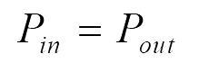
      

    ..(5)
      

  
      

&nbsp;

  
      

    ..(6)
      

  

 
Substituting eqn. 4 into eqn. 10
  

  
      

    ..(7)
      

 
  
  **c) Inductor current ripple (Lm):**
 

  
From eqn. 1
  

  
      

    ..(8)
      

 

Therefore, the inductor ripple current is
  

 

  
      

    ..(9)
      

 

**d) Current through various components:**     

The current through various components is given in Fig. 3.

  
  
Fig. 3 Current through various components.

 

 

 

**e) Voltage and current stress on various components:**

 

<table align="center" width="100%" >
  <tr style="text-align: center; font-weight: bold; background-color: #c9c9c9;">
    <td style="text-align: center; font-weight: bold;">Component</td>
    <td style="text-align: center; font-weight: bold;">Voltage stress</td>
    <td style="text-align: center; font-weight: bold;">Current Stress</td>
  </tr>
  <tr style="background-color: #FFF;">
    <td>Magnetising Inductor (Lm)</td>
    <td></td>
    <td></td>
  </tr>
  <tr style="background-color: #FFF;">
    <td>Capacitor (C)</td>
    <td></td>
    <td></td>
  </tr>
  <tr style="background-color: #FFF;">
    <td>Switch (Sw)</td>
    <td></td>
    <td></td>
  </tr>
  <tr style="background-color: #FFF;">
    <td>Diode (Db)</td>
    <td></td>
    <td></td>
  </tr>
</table>

 

 

 

**g) Efficiency analysis:**     

 

  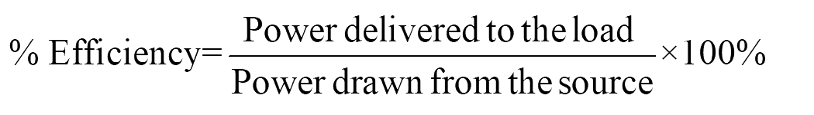
      

    ..(10)
      

      

  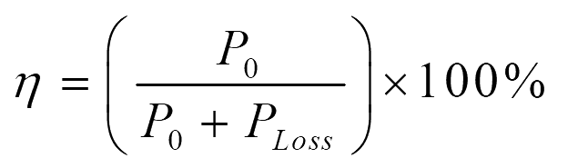
      

    ..(11)
      

  
     
The power loss occurring in various components are given below.  
Power loss in inductor:

 

  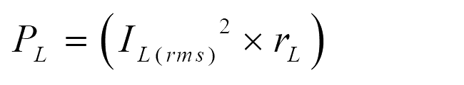
      

    ..(12)
      

  

  
Power loss in capacitor:    

  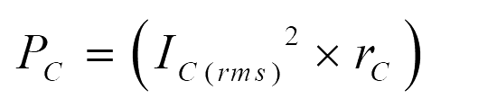
      

    ..(13)
      

 

Power loss in switch:

 

  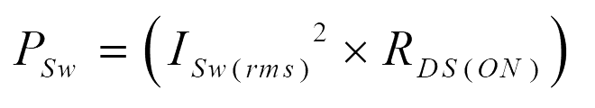
      

    ..(14)
      

  

  
Power loss in Diode:   

  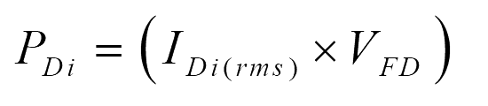
      

    ..(15)
      

 
     
Total power loss:

 

  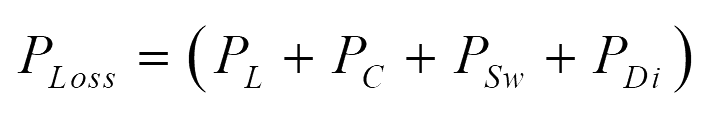
      

    ..(16)
      

  

 

**g) Effect of non-idealities on voltage gain expression:**     

  

  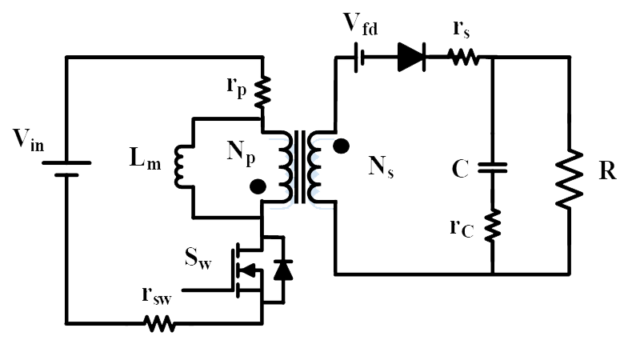
  
Fig. 4. Circuit configuration of flyback converter with non-idealities

  

  

Voltage across inductor Lm is 

**Mode – I :**

 

  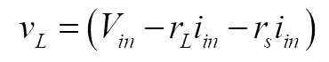 

    ..(17)

  

     
**Mode – II :**

 

  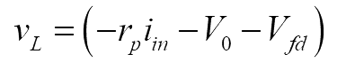 
      

    ..(18)
      
     

  
  
Applying volt-sec balance on inductor (eqn. 17 and 18)     

  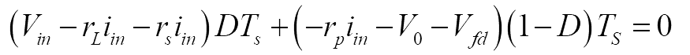
      

    ..(19)
      

 
     
Simplifying eqn. (19) results in

 
  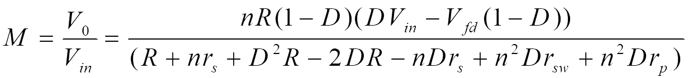
      

 
    ..(20)
      

  
